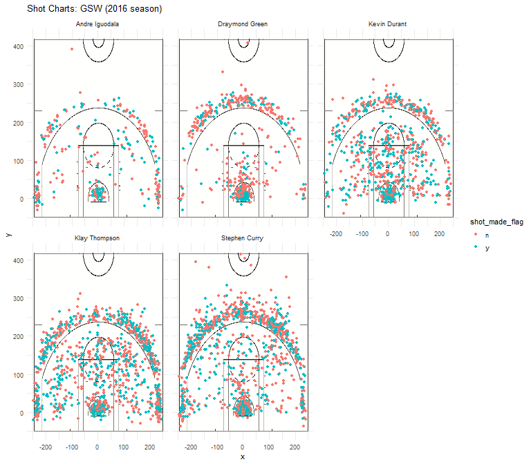

workout01-jaesung-lee.Rmd
================
Jaesung Lee

Golden State Warriors is Not a One-Man Team
===========================================

### Background

------------------------------------------------------------------------

Stephen Curry is one of the most popular players in NBA history, and is renowned for his world class shooting accuracy. Not only that, his passing ability, agile moves and speed also makes him a world-class game maker and at the same time, a game changer. Presence of Stephen Curry led the team to win the Pacific Division title and Western Conference Championship for 16-17 season, setting numerous records as a team in the NBA history. They also won fifth NBA Championship trophy, setting the best postseason record in NBA history.

However, some skeptic people asked what might have happened in 16-17 season if there was no Stephen Curry in Golden State Warriors. While people praise Stephen Curry, all-time best point guard, they also comment that he is the only player who makes majority of contribution in Golden State Warriors.

### Motivation and Purpose

------------------------------------------------------------------------

As an international student without any background knowledge on the basketball league in the US, I was unfamiliar with NBA teams nor the names of individual players. However, Golden State Warriors was the only team I was aware of, due to their excellent performance and proximity to Berkeley, CA. I wanted to get familiar to the team by analyzing the player's performances with a given data.

The purpose of the report is as follows. First, in order to check if Stephen Curry's shooting accuracy is the highest among the team members, I analyzed the shooting frequency and measured accuracy ratio for each of the players. Players include Andre Iguodala, Draymond Green, Kevin Durant, Klay Thompson and Stephen Curry. Due to the fact that one of the variables that may affect the shooting accuracy ratio is the distance to the basketball rim, I divided the shot data into two groups: two-point and three-point shots. To understand the general shooting accuracy of the corresponding player, I have also calculated overall shooting accuracy that includes shots for both points. Secondly, utilizing the coordinates within the data, I managed to visualize the precise locations where the shot attempts occurred and distinguished whether the shots were successful or not with distinct colors.

### Detailed DCR Process (Data Preparation - Core Analysis - Reporting)

------------------------------------------------------------------------

Acquisition of the data directly comes from the GitHub repo, provided by professor Gaston Sanchez. I utilized total of five data sets that corresponds to each players: Andre Iguodala, Draymond Green, Kevin Durant, Klay Thompson and Stephen Curry. Detailed explanation for the raw data is included in the data-dictionary.md file in the data folder. For data cleansing process, I simplified the data by replacing shot\_no and shot\_yes to n and y. To simplify the data and to extract more valuable interpretation, I created an additional column to identify the elapsed total time of the game.

I extracted summary text files for both individual players and all players. Summary includes some of the basic statistical analysis such as minimum, maximum, mean, median, quartile values etc. It was interesting that the mean time of the total shot attempts by all five players was 22.8 minutes and 23 minutes for the median time, which is slightly smaller than half of the total game time, 48 minutes. This might be due to various reasons, including lack of physical stamina in the last minutes of the game or replacement, considering the fact that five players in our dataset usually starts the game and get replaced at the end.

Visualization was one of the most vital process that enable us to understand the complex data with a preattentive vision. Court background was used to visualize the coordinates at a basketball-court setting. Here is an actual code for Stephen Curry, used to visualize the coordinate data into actual plots with a court background.

> curry\_shot\_chart &lt;- ggplot(data = curry) + annotation\_custom(court\_image, -250, 250, -50, 420) + geom\_point(aes(x = x, y = y, color = shot\_made\_flag)) + ylim(-50, 420) + ggtitle('Shot Chart: Stephen Curry (2016 season)') + theme\_minimal()

Through the code below, I also managed to construct a facetted shot chart, which includes five charts for each players, and here is the following.

    ## 
    ## Attaching package: 'dplyr'

    ## The following objects are masked from 'package:stats':
    ## 
    ##     filter, lag

    ## The following objects are masked from 'package:base':
    ## 
    ##     intersect, setdiff, setequal, union



By comparing the density of the coordinate chart, we can see that the Klay Thompson and Stephen Curry attempted more shots than Andre Iguodala and Draymond Green. Not only that, high proportion of the Curry's shots took place behind the three-point line, due to his position as a point guard.

While it is easier and simpler to understand the visualized data, some of the limitations of the diagram above are inability to deduce the precise numbers and complexity due to large datasets. In this case, both limitations apply. Thus I have measured the total attempts of shots (2pt, 3pt, all) of each players and the number of successful shots for detailed analysis and comparison. The last column is a ratio of successful shot, with a function of made divided by total. Here are the actual data frames.

``` r
# 2PT Effective Shooting % by Player
shots_data <- read.csv("../data/shots-data.csv", header = TRUE)
A <- shots_data %>% group_by(name, shot_type) %>% summarise(total = n()) %>% filter(shot_type == "2PT Field Goal") %>% select(name, total)
B <- shots_data %>% group_by(name, shot_type, shot_made_flag) %>% summarise(made = n()) %>% filter(shot_type == "2PT Field Goal" & shot_made_flag == "y") %>% select(name, made)
```

    ## Adding missing grouping variables: `shot_type`

``` r
A$made <- B$made
A$perc_made <- A$made/A$total
PT2_shooting <- arrange(A,desc(perc_made))
PT2_shooting
```

    ## # A tibble: 5 x 4
    ## # Groups:   name [5]
    ##   name           total  made perc_made
    ##   <fct>          <int> <int>     <dbl>
    ## 1 Andre Iguodala   210   134     0.638
    ## 2 Kevin Durant     643   390     0.607
    ## 3 Stephen Curry    563   304     0.540
    ## 4 Klay Thompson    640   329     0.514
    ## 5 Draymond Green   346   171     0.494

``` r
# 3PT Effective Shooting % by Player
C <- shots_data %>% group_by(name, shot_type) %>% summarise(total = n()) %>% filter(shot_type == "3PT Field Goal") %>% select(name, total)
D <- shots_data %>% group_by(name, shot_type, shot_made_flag) %>% summarise(made = n()) %>% filter(shot_type == "3PT Field Goal" & shot_made_flag == "y") %>% select(name, made)
```

    ## Adding missing grouping variables: `shot_type`

``` r
C$made <- D$made
C$perc_made <- C$made/C$total
PT3_shooting <- arrange(C,desc(perc_made))
PT3_shooting
```

    ## # A tibble: 5 x 4
    ## # Groups:   name [5]
    ##   name           total  made perc_made
    ##   <fct>          <int> <int>     <dbl>
    ## 1 Klay Thompson    580   246     0.424
    ## 2 Stephen Curry    687   280     0.408
    ## 3 Kevin Durant     272   105     0.386
    ## 4 Andre Iguodala   161    58     0.360
    ## 5 Draymond Green   232    74     0.319

``` r
# Effective Shooting % by Player
E <- shots_data %>% group_by(name) %>% summarise(total = n()) %>% select(name, total)
F <- shots_data %>% group_by(name, shot_made_flag) %>% summarise(made = n()) %>% filter(shot_made_flag == "y") %>% select(name, made)
E$made <- F$made
E$perc_made <- E$made/E$total
all_shooting <- arrange(E,desc(perc_made))
all_shooting
```

    ## # A tibble: 5 x 4
    ##   name           total  made perc_made
    ##   <fct>          <int> <int>     <dbl>
    ## 1 Kevin Durant     915   495     0.541
    ## 2 Andre Iguodala   371   192     0.518
    ## 3 Klay Thompson   1220   575     0.471
    ## 4 Stephen Curry   1250   584     0.467
    ## 5 Draymond Green   578   245     0.424

All three data frames are in descending order of the shot accuracy. Surprisingly, Stephen Curry is not ranked in the first row for any of the tables. For two-point shots, Andre Iguodala recorded the highest accuracy, recording 64%. However, his total attempt of the shots is less than one thirds of that of Kevin Durant. While Kevin Durant threw 643 shots, which is 80 more attempts than that of Stephen Curry, his accuracy is about 3 percent higher. For three-point shots, Stephen Curry, again, failed to earn the title for the highest accuracy. In fact, Klay Thompson had the highest accuracy of 42 percent, which is again 3 percent higher than that of Curry. When we read the third table, curry's shooting accuracy is second to the lowest. However, both of his total attempts and number of successful shots were the largest. In other words, his contribution for earning points and number of shot attempts was high. Klay Thompson and Stephen Curry are the two players who recorded over 1000 attempts and 500 successful shots; but Thompson made more two-point shots while Curry made more three pointers.

### Conclusion

------------------------------------------------------------------------

Although we cannot deny the fact that Stephen Curry made a high contribution to the team, Kevin Durant, Andre Iguodala, Klay Thompson recorded higher accuracy rate than Curry. However, considering the high proportion of three-point shots and the large number of attempts, Stephen Curry is more than enough to be called as a world-class shooter. To sum up, the data itself disagrees on the argument that Golden State Warriors is a one-man team, due to other player's effective shooting accuracy and their high contribution for earning points, sometimes even better than Stephen Curry's.
